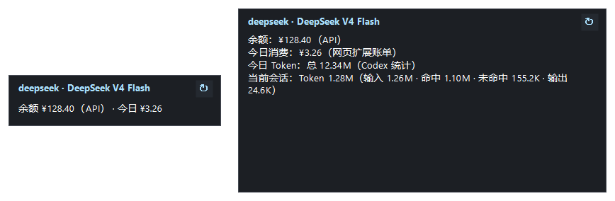

# Codex Usage Hub

[](https://github.com/mym-666/codex-usage-hub/actions/workflows/ci.yml)
[](LICENSE)


A Windows plugin for the Codex desktop app that keeps a small always-on-top overlay next to your
Codex window showing the provider balance, today's spend and the token usage of the current session.
Token detail comes from Codex's own records; the exact DeepSeek web bill is an optional bonus.

[中文说明 / Chinese README](README.zh-CN.md)



## What it shows

| Row | Where it comes from |
| --- | --- |
| `provider · model` | `~/.codex/config.toml`, falling back to CC Switch |
| `余额` | Provider balance API first, provider website second, labelled `（API）` / `（官网）` |
| `今日消费` | Exact web bill, then balance delta, then CC Switch local aggregate |
| `今日 Token：总 …` | Fresh web-bill tokens, otherwise Codex's own rollout logs (labelled `（Codex 统计）`) |
| `当前会话：Token …（输入 · 命中 · 未命中 · 输出）` | Codex rollout logs (`thread_token_usage`) |

Unit prices come from the provider adapter shipped with this plugin (`runtime/providers/*.json`); a
model the adapter does not declare falls back to CC Switch's `model_pricing` table.

Collapsed, the overlay shows one line: `余额 ¥12.34（API）· 今日 ¥3.21`. Click it to expand,
right-click for refresh / follow / font size / exit. A tray icon mirrors the same menu.

## Features

- **No extra software required.** Token usage and the current session are read from Codex's own
  rollout logs, so the overlay is useful before you configure anything else.
- **Balance that survives real setups.** The provider API is probed with every credential the
  machine has (plugin config, provider config, CC Switch, Codex `auth.json`) and falls back to the
  value the browser bridge captured from the provider website.
- **Honest labels.** Every number carries its source, and stale data is marked instead of silently
  passed off as current.
- **DeepSeek web-bill bridge (optional, Edge).** Captures the platform's own usage response for an
  exact daily cost and token breakdown.
- **Local only.** No telemetry, no account, no cloud service. The web-bill receiver listens on
  loopback `127.0.0.1:32146` and the plugin only talks to the provider you configured.
- **MCP tools.** `usage_snapshot`, `usage_runtime_status` and `usage_overlay_control` let the Codex
  agent read and control the overlay on your behalf.
## Requirements

| Requirement | Notes |
| --- | --- |
| Windows 10/11 | The overlay is a WinForms window; macOS and Linux are not supported |
| Codex desktop app with plugin + MCP support | `codex plugin --help` must work |
| Node.js 22 or newer | Usually already installed with Codex. The launcher only runs `node.exe` from an allowlisted location: `CODEX_MCP_NODE_PATH`, `%ProgramFiles%\nodejs`, `%LOCALAPPDATA%\OpenAI\Codex\runtimes`, `%USERPROFILE%\.cache\codex-runtimes`. A `node.exe` anywhere else on `PATH` is skipped and never executed |
| A configured provider | `%USERPROFILE%\.codex\config.toml` |
| Edge, logged in to `platform.deepseek.com` | Optional: only for the exact DeepSeek web bill |
| CC Switch | Optional: adds the provider row and local aggregates. Model prices ship with the plugin adapter; CC Switch only fills models the adapter does not declare |

## Install

1. Download or clone this repository to any folder.
2. Double-click `install.cmd`, or run the equivalent commands from that folder:

   ```powershell
   codex plugin marketplace add .
   codex plugin add usage-hub@usage-hub-local
   ```

   The installer resolves its own path, checks the marketplace/plugin/extension files, finds
   `codex.exe` and registers this checkout as the `usage-hub-local` marketplace. Running it twice is
   safe; an existing installation is skipped.
3. Start a new Codex thread. The plugin MCP server starts the overlay automatically. The overlay
   follows the Codex window, hides when Codex is minimized, and exits when Codex closes.

## Optional: exact DeepSeek web bill

The Edge extension is not installed by a script - load it by hand:

1. Ask the plugin for `usage_runtime_status` and copy the returned `extensionPath`
   (it points at `plugins/usage-hub/edge-extension` inside the installed plugin cache).
2. Open `edge://extensions`, enable Developer mode.
3. Remove an older `Usage Hub Web Bill Bridge` copy, or use Reload and select the new directory.
4. Click **Load unpacked** and select the `extensionPath` directory.
5. Keep Edge logged in to `platform.deepseek.com`.

The extension version must read **1.7.1**. 1.6.0 silently dropped every captured bill, and 1.7.0
shipped without the account-summary path constant, so it never captured the website balance. Because
the Codex plugin cache directory contains a version suffix, reload the extension after every plugin
update.

Without the extension the overlay still works: today's cost falls back to a balance-delta estimate
and the token detail falls back to Codex's rollout logs, each with its source labelled.
## MCP tools

| Tool | Purpose |
| --- | --- |
| `usage_snapshot` | Balance, today's usage, current session, token breakdown, pricing, source labels, warnings |
| `usage_runtime_status` | Overlay / helper / web-bill server state, extension path, config, `receiverError`, `webBillServer.foreign` |
| `usage_overlay_control` | `show`, `hide` or `restart` the overlay |

Useful fields in `usage_snapshot`:

- `today.tokenSource` - `api` (provider API), `estimate`, `dom-scrape` (scraped from page text,
  indicative only) or `cc-switch`.
- `today.tokenScope` - `web` (exact web bill) or `codex` (Codex rollout logs).
- `balance.source` - `provider-api` or `web-extension`.
- `session.source` - always `codex-log`; it describes the most recently written Codex thread.
- `source.providerIdentity` - `codex-config` or `cc-switch`.
- `source.databaseMode` - `direct` or `copy-fallback` for the CC Switch database.
- `webBillStatus` - always marked `untrusted: true`; the text originates in a browser page.

See [docs/architecture.md](docs/architecture.md) for the full data flow.

## Configuration

`%LOCALAPPDATA%\UsageHubPlugin\config.json` is optional - the defaults are sensible without it:

| Key | Default | Purpose |
| --- | --- | --- |
| `refreshSeconds` | `60` | Snapshot refresh interval |
| `webUsage` | `true` | Set to `false` to stop all provider-website requests |
| `allowBalanceDelta` | `true` | Allow today's cost to be estimated from the balance drop |
| `browserOrder` | `["edge", "chrome"]` | Order used when a login token has to be read from browser storage |
| `apiKey` | `""` | Explicit provider key for balance probes |
| `providers.<id>.apiKey` | - | Per-provider key override |
| `browserTokens.<webId>` | - | Static website token instead of reading browser storage |
| `providersDirs` | `[]` | Extra adapter directories (see [docs/architecture.md](docs/architecture.md)) |
| `overlayAutoStart` | `true` | Set to `false` to keep the overlay off until a tool calls `usage_overlay_control` |
| `overlayStartDelaySeconds` | `3` | Delay before the automatic overlay start, so it does not land on Codex's own start-up burst |
| `overlayIdleExitSeconds` | `300` | How long a hidden overlay stays warm after Codex closes, so reopening Codex reuses it (`15` restores the old immediate exit) |

## Performance

The plugin runs inside Codex, so it has to stay out of Codex's way:

- The overlay (PowerShell + WinForms) and the helper daemon are started by the plugin MCP server.
  Their automatic start is staggered by `overlayStartDelaySeconds` (default 3 s) so a Codex restart
  does not pay for two start-up bursts at the same time.
- When Codex closes, the hidden overlay stays warm for `overlayIdleExitSeconds` (default 300 s) and
  the next MCP server reuses it, so switching threads never pays the PowerShell + WinForms start
  twice. Codex terminates its process tree on exit, so a full app restart usually reclaims the
  overlay anyway - see standalone mode below.
- The helper polls once a minute by default (`refreshSeconds`) and only rewrites `snapshot.json`
  when the payload really changed (a newer `updatedAt` alone is not a change), so a tick with no
  new data performs no disk I/O and triggers no repaint. The overlay's timers also skip their work
  while the card is hidden.
- `usage_overlay_control` (`show` / `restart`) never waits for the stagger.

### Running the overlay on demand

`"overlayAutoStart": false` in `config.json` keeps the overlay, the helper and the web-bill receiver
out of Codex start-up completely: nothing is started for them at all, and the watchdog will not
resurrect them either.

In on-demand mode the overlay also comes up by itself the first time you use the plugin: `@Usage Hub`,
the default prompt `Show my current Codex usage and balance.`, or any `usage_snapshot` call starts it.
The launchers below cover the other case - an overlay that should keep running across Codex restarts.

```powershell
# Double-click entry points, or run them from a shell:
tools\start-usage-hub.cmd     # standalone overlay: not a child of Codex, so it survives Codex restarts
tools\stop-usage-hub.cmd      # stops the overlay, its helper and the web-bill receiver
tools\usage-hub-overlay.cmd status
```

The standalone overlay uses the same data directory as the plugin, so the tray menu, font settings and
web-bill bridge keep working and `usage_runtime_status` reports it as the running overlay. If you
prefer Codex to own the overlay instead, `usage_overlay_control` with `show` starts a managed one.

To clear state left behind by a crash or a forced shutdown:

```powershell
# Report only
powershell -NoProfile -ExecutionPolicy Bypass -File tools/cleanup-runtime-state.ps1
# Remove stale owner/pid files and stop orphaned overlay/helper processes
powershell -NoProfile -ExecutionPolicy Bypass -File tools/cleanup-runtime-state.ps1 -Apply -StopOrphans
```

## Privacy

- All data stays on the machine. There is no telemetry and no third-party endpoint.
- API keys, cookies and platform tokens are never written to disk by the plugin. When the browser
  bridge has not supplied a current bill, the helper may read the provider login token from
  Edge/Chrome `Local Storage` **in memory**, scoped to that exact website origin, and use it only
  against that same website. Set `webUsage` to `false` to disable that path entirely.
- Credential-shaped strings are redacted before anything reaches `plugin.log` or `usage_snapshot`.
- Codex rollout logs are read for token counts and thread ids only; message content is never parsed
  or stored.

Full privacy notice: [PRIVACY.md](PRIVACY.md). Full threat model and reporting process: [SECURITY.md](SECURITY.md).
## Troubleshooting

| Symptom | Check |
| --- | --- |
| No overlay | Start a new Codex thread; the overlay is created by the plugin MCP server. Then run `usage_runtime_status` and look at `overlay.running` and `ownerHeartbeatAt` |
| Overlay disappears immediately | `ownerHeartbeatAt` should be less than 60 s old. Choosing Exit in the overlay menu suppresses restarts until the plugin reloads |
| `receiverError` is not null | Another process holds port 32146, or the helper could not start. Report the `code` and `message` verbatim |
| Balance shows `--` | No credential could read a balance endpoint. Configure `apiKey`, or install the Edge extension for the website value |
| Today's cost looks like an estimate | `today.source` is `balance_delta` or `cc-switch`; the web bill is stale or missing |
| Codex feels slow right after opening a thread | The overlay is a separate PowerShell + WinForms process. Raise `overlayStartDelaySeconds`, set `overlayAutoStart` to `false`, or clean up stale state with `tools/cleanup-runtime-state.ps1 -Apply -StopOrphans` |
| Tokens marked as page-scraped (`dom-scrape`) | The bill came from page text. Open `platform.deepseek.com/usage` once so the extension captures the API response, or wait for the Codex-log fallback |

## Development

```powershell
# Run the whole test suite (69 tests, no network and no real user data required)
powershell -NoProfile -ExecutionPolicy Bypass -File plugins/usage-hub/tests/run-tests.ps1

# Run a subset
powershell -NoProfile -ExecutionPolicy Bypass -File plugins/usage-hub/tests/run-tests.ps1 -NamePattern balance

# Validate the plugin, marketplace, MCP and extension manifests
powershell -NoProfile -ExecutionPolicy Bypass -File tools/validate-manifests.ps1
```

- Layout and data flow: [docs/architecture.md](docs/architecture.md)
- Contributing rules, including the local iteration loop: [CONTRIBUTING.md](CONTRIBUTING.md)
- Release history: [CHANGELOG.md](CHANGELOG.md)
- Code of conduct: [CODE_OF_CONDUCT.md](CODE_OF_CONDUCT.md)
- Support and contact: [SUPPORT.md](SUPPORT.md)
- Security policy: [SECURITY.md](SECURITY.md)
- Privacy notice: [PRIVACY.md](PRIVACY.md)
- Copyright and contributors: [AUTHORS.md](AUTHORS.md), [COPYRIGHT](COPYRIGHT)

## Uninstall

Remove the extension from `edge://extensions`, then:

```powershell
codex plugin remove usage-hub
codex plugin marketplace remove usage-hub-local
```

The plugin creates no Windows startup entry. The data directory
`%LOCALAPPDATA%\UsageHubPlugin` can be deleted afterwards.

## Author

Andy Miao ([@mym-666](https://github.com/mym-666)) · [1561713602@qq.com](mailto:1561713602@qq.com)

## License

Copyright (C) 2026 Andy Miao.

Codex Usage Hub is free software: you can redistribute it and/or modify it under the terms of the
GNU General Public License as published by the Free Software Foundation, version 3 only. See
[LICENSE](LICENSE) for the complete license text.